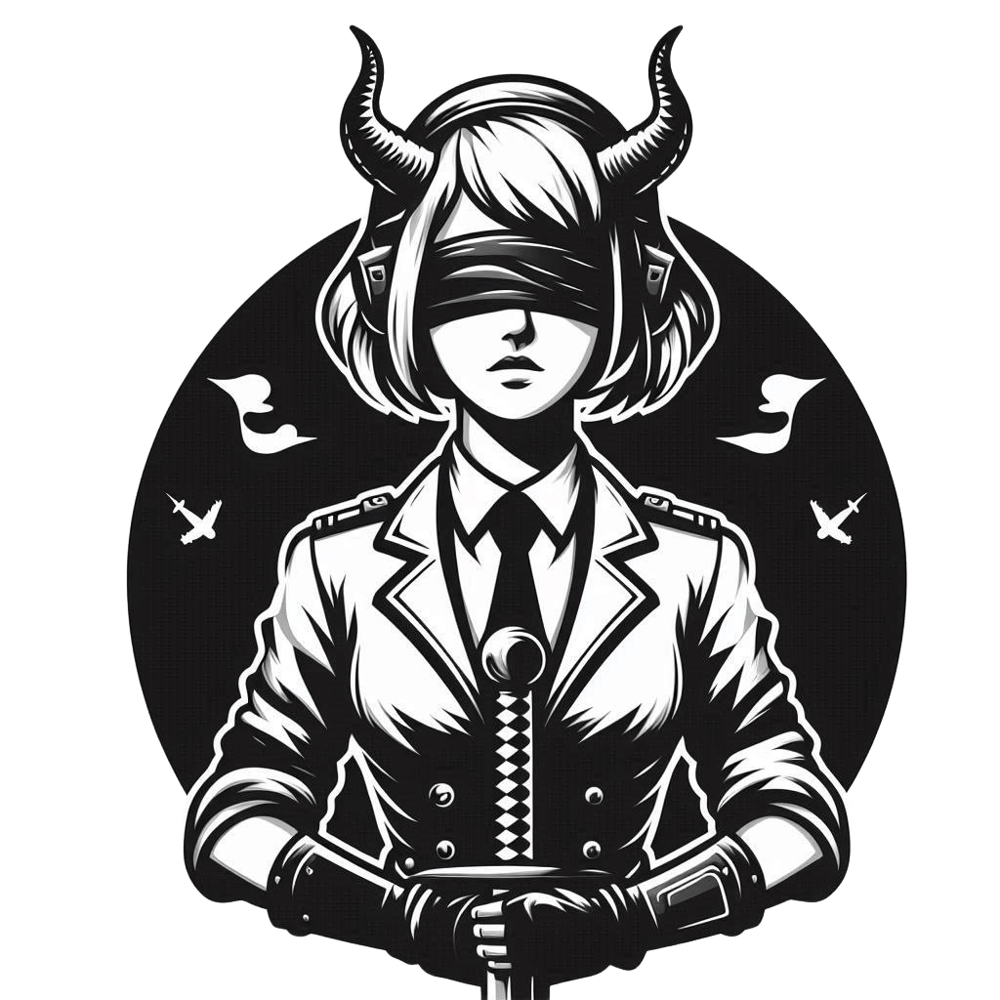
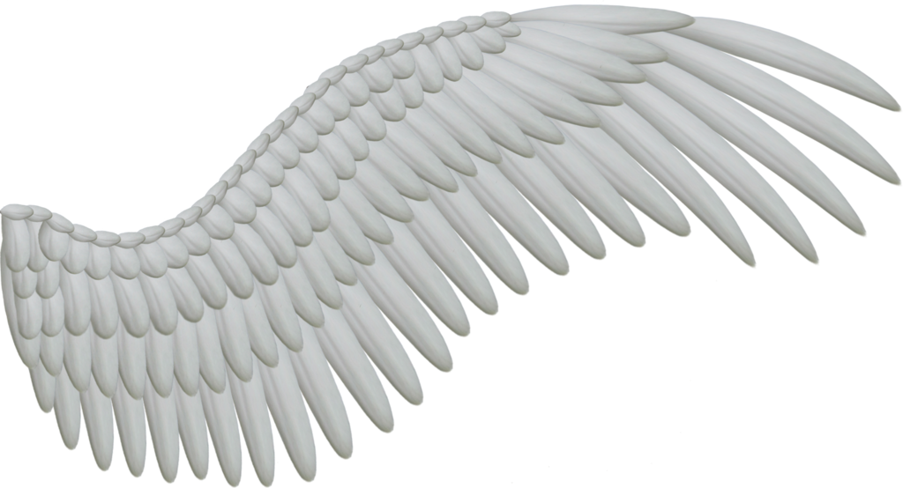

<h2 align="center">Danistans</h2>

  
  
  

<h3 align="center">Hearth of Hyperion</h3>

  

---

### 🛡️ About me

- Master of **Hearth of Hyperion (13)**
- Developer of **Hyperion Security Suite**
- Chief sec off. of **Battle wing of Hyperion**
- **BYOND** coder, mentor in **Academy of junior contributors**
- Just a noname without fame

---

### 💻 Simple comp.

- **Web, Network**
- **DevOps, System administration**
- **Docker deployment**
- **Langs: DreamMaker, Python, bash**
- **Linux multiboot user**
- **More than you wanna know**

---
### In before

- In preparation for the **CompTIA Security+ exam**
---
### 📫 Write to me

- **Discord:** *hentai.russia*

### 🍩 U know
- *https://boosty.to/danistans/donate*
---

